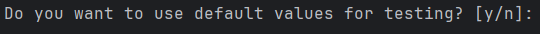
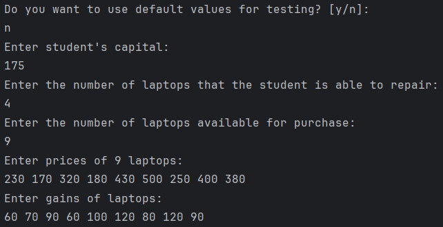
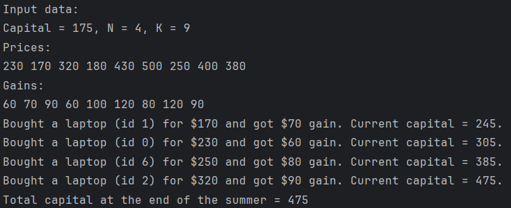

# Student's capital
<h3>Technical task for Distributed Lab</h3>
Student on summer holiday wants to increase his capital by buying, fixing, and selling laptops. 
He has start-up capital and is able to repair a certain number of laptops. 
Student has a list of prices for laptops and a list of net profits from their sale. 
It is necessary to develop an application that will help him maximise his capital.
<h3>How to Run</h3>
1. Clone repository to CLion. 
2. Run in IDE [Shift+F10]. 
3. Select the default values if you want. 
   
4. Enter your own values (optional). 
   
5. View results.
   
<h3>Remark</h3>
No examples of input data were provided.  
So, I referred to the context of the task: 
- student is unable to repair many laptops during the summer,
- the price of a laptop and the profit that can be made from its sale are not related. 
(a cheaper laptop can bring more profit than a more expensive one) 
(this is due to the degree of the laptop's malfunction). 
In accordance with these points, I decided not to complicate the application with more complex data structures and additional sorts.
